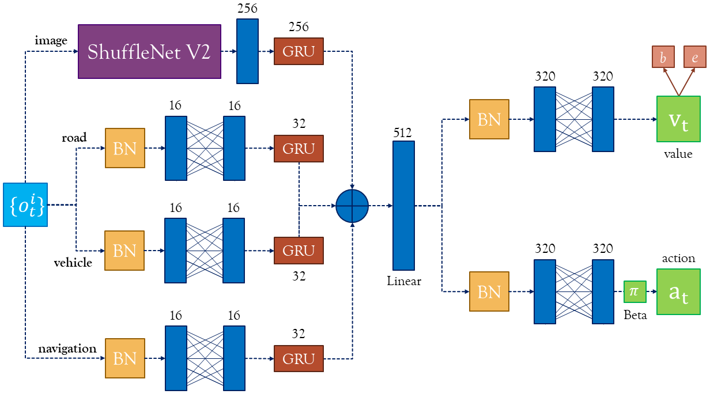
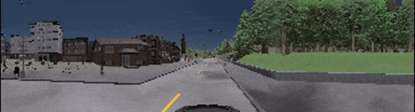
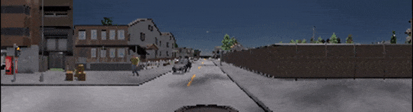
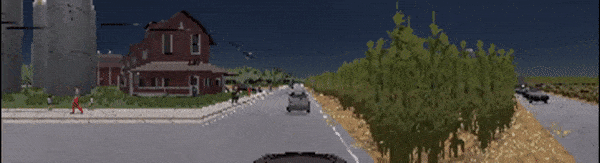
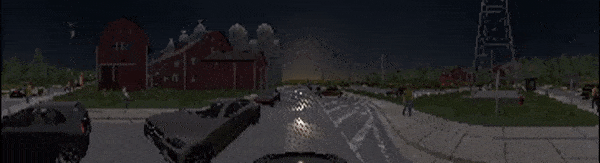
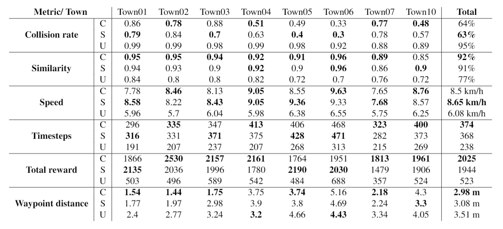

## Requirements

Software:
- Python 3.7
- CARLA 0.9.9
- Libraries: install from `requirements.txt`

Hardware (minimum):
- CPU: at least quad or octa core.
- GPU: dedicated, with as much memory as possible.
- RAM: at least 16 or 32 Gb.

---

## Installation

Before running any code from this repo you have to:
1. **Clone this repo**: `git clone https://github.com/Luca96/carla-driving-rl-agent.git`
2. **Download CARLA 0.9.9** from their GitHub repo, [here](https://github.com/carla-simulator/carla/releases/tag/0.9.9) 
   where you can find precompiled binaries which are ready-to-use. Refer to [carla-quickstart](https://carla.readthedocs.io/en/latest/start_quickstart/)
   for more information.
3. **Install CARLA Python bindings** in order to be able to manage CARLA from Python code. Open your terminal and type:
   
    * *Windows*: `cd your-path-to-carla/CARLA_0.9.9.4/WindowsNoEditor/PythonAPI/carla/dist/`
    * *Linux*: `cd your-path-to-carla/CARLA_0.9.9.4/PythonAPI/carla/dist/`
    * Extract `carla-0.9.9-py3.7-XXX-amd64.egg` where `XXX` depends on your OS, e.g. `win` for Windows.
    * conda environment installation
    ```
      conda create -n carla-ppo python=3.5
      conda activate carla-ppo
      conda install -c conda-forge cudatoolkit=10.1 cudnn=7.6
      
      # settings for conda activation
      mkdir -p $CONDA_PREFIX/etc/conda/activate.d
      echo 'export LD_LIBRARY_PATH=$LD_LIBRARY_PATH:$CONDA_PREFIX/lib/' > $CONDA_PREFIX/etc/conda/activate.d/env_vars.sh
      echo 'export PYTHONPATH=path-to-your-carla/PythonAPI/carla/dist/carla-0.9.6-py3.5-linux-x86_64.egg' >> $CONDA_PREFIX/etc/conda/activate.d/env_vars.sh
      
      conda deactivate 
      conda activate carla-ppo
      cd your-path-to-carla
      pip install -r requirements.txt
    
    ```

Before running the repository's code be sure to **start CARLA first**: 
* *Windows*: `your-path-to/CARLA_0.9.9.4/WindowsNoEditor/CarlaUE4.exe`
* *Linux*: `your-path-to/CARLA_0.9.9.4/./CarlaUE4.sh`
* [optional] To use less resources add these flags to the previous command: `-windowed -ResX=32 -ResY=32 --quality-level=Low`.
    For example `./CarlaUE4.sh --quality-level=Low`.

---


## Agent Architecture

The agent leverages the following neural network architecture:



* At each timestep $t$ the agent receives an observation $o_t=\{ o_t^1,\ldots,o_t^4 \}$, where each $o_t^i=[\texttt{image},\texttt{road},\texttt{vehicle},\texttt{navigation}]$.
* So, each component of $o_t^i$ is respectively processed by a [ShuffleNet v2](http://openaccess.thecvf.com/content_ECCV_2018/papers/Ningning_Light-weight_CNN_Architecture_ECCV_2018_paper.pdf), and feed-forward neural networks. Note that layers aren't copied, so the same layers are applied to each $o_t^i$ for which we get four outputs that are aggregated into a single one by Gated Recurrent Units (GRUs).
* The output of each GRU is then concatenated into a single vector, which is linearly combined (i.e. *linear activation function*) into 512 units.
* The output of such operation is the input for both the *value* and *policy* branches. 

For more details refer to `core/networks.py`, in particular to the `dynamics_layers` function and `CARLANetwork` class.

---

## Results

All the experiments were run on a machine with:
- CPU: Intel i9-10980XE 3.00Ghz 18C/36T,
- RAM: 128Gb RAM,
- GPU: Nvidia Quadro RTX 6000 24Gb.

All agents were evaluated on six metrics (*collision rate, similarity, speed, waypoint distance, total reward, and timesteps*), two disjoint weather sets (only one used during training), over all CARLA towns (from `Town01` to `Town10`) but only trained on `Town03`.

`Town01`, daylight:



`Town02`, daylight:



`Town07`, evening:



`Town07`, night:



The following table shows the performance of three agents: *curriculum* (C), *standard* (S), and *untrained* (U). The curriculum agent (C) combines PPO with curriculum learning, whereas the standard agent (S) doesn't use any curriculum. Lastly, the untrained agent (U) has the same architecture of the other two but with random weights, so it just provides (non-trivial) baseline performance for comparison purpose.


For detailed results over each evaluation scenario, refer to the extensive evaluation table: `src\extensive_evaluation_table`.


