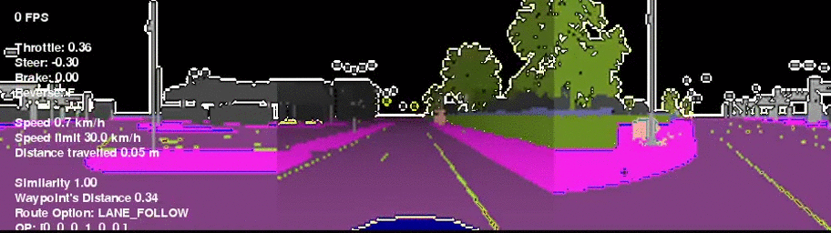

# CARLA Driving RL Agent
*Master's thesis project* involving **deep reinforcement learning** to train an **autonomous driving agent**. In particular, the 
driving agent is trained by following the *Proximal Policy Optimization* algorithm ([PPO](https://arxiv.org/pdf/1707.06347))
within a simulated driving environment provided by the *CARLA* simulator ([website](http://carla.org/), [paper](https://arxiv.org/pdf/1711.03938)).

The reinforcement learning phase is organized into increasingly difficult *stages*, following the idea of 
[Curriculum Learning](https://qmro.qmul.ac.uk/xmlui/bitstream/handle/123456789/15972/Bengio%2C%202009%20Curriculum%20Learning.pdf?sequence=1&isAllowed=y).
Initially, the agent's network is initialized by performing *imitation learning* on expert trajectories, collected by 
using CARLA.

Requirements, installation instructions, and results are listed below.

---

## Requirements

Software:
- Python 3.7
- CARLA 0.9.9
- Libraries: install from `requirements.txt`

Hardware (recommended):
- CPU: at least quad or octa core.
- GPU: dedicated, mid-range or high-end.
- RAM: at least 16 or 32 Gb.

## Installation

Before running any code from this repo you have to:
1. **Download CARLA 0.9.9** from their GitHub repo, [here](https://github.com/carla-simulator/carla/releases/tag/0.9.9) 
   where you can find precompiled binaries which are ready-to-use. Refer to [carla-quickstart](https://carla.readthedocs.io/en/latest/start_quickstart/)
   for more information.
2. **Install CARLA's Python bindings** in order to be able to manage CARLA from Python code. Open your terminal and type:
    * *Windows*: `cd your-path-to-carla/CARLA_0.9.9.4/WindowsNoEditor/PythonAPI/carla/dist/`
    * *Linux*: `cd your-path-to-carla/CARLA_0.9.9.4/PythonAPI/carla/dist/`
    * Extract `carla-0.9.9-py3.7-XXX-amd64.egg` where `XXX` depends on your OS, e.g. `win` for Windows.
    * Create a `setup.py` file within the extracted folder and write the following:
      ```python
      from distutils.core import setup
      
      setup(name='carla',
            version='0.9.9',
            py_modules=['carla']) 
      ```
    * Install via pip: `pip install -e ~/CARLA_0.9.9.4/PythonAPI/carla/dist/carla-0.9.9-py3.7-XXX-amd64`
3. **Clone this repo**: `git clone https://github.com/Luca96/carla-driving-rl-agent.git`


Before running the repo's code be sure to **start CARLA first**: 
* *Windows*: `your-path-to/CARLA_0.9.9.4/WindowsNoEditor/CarlaUE4.exe`
* *Linux*: `your-path-to/CARLA_0.9.9.4/./CarlaUE4.sh`
* [optional] To use less resources add these flags to the previous command: `-windowed -ResX=8 -ResY=8 --quality-level=Low`.
    For example `./CarlaUE4.sh --quality-level=Low`.

## Examples
Show the agent's network architecture (without running CARLA):
```python
from core import CARLAgent, FakeCARLAEnvironment

agent = CARLAgent(FakeCARLAEnvironment(), batch_size=32, log_mode=None)
agent.summary()
```

Test (or play with) the CARLA environment (requires running CARLA):
```python
from core import CARLAEnv
from rl.environments import CARLAPlayWrapper
 
# Set `debug=False` is the framerate is very low.
# For better image quality, increase `image_shape` according to your hardware.
env = CARLAEnv(debug=True, window_size=(900, 245), image_shape=(90, 120, 3)) 
CARLAPlayWrapper(env).play()
```

Data collection and Imitation Learning:
```python
from main import collect_experience
from core import learning

# collect data first
collect_experience(amount=30, threshold=0.75, name='imitation', behaviour='normal')

# imitate then
learning.imitation_learning(batch_size=64, lr=3e-4, num_traces=50, epochs=3, alpha=1.0, beta=1.0, clip=0.5)
```

Reinforcement learning example:
```python
from core import learning

# assume agent initialized with imitation learning
learning.stage_s1(episodes=5, timesteps=256, gamma=0.999, lambda_=0.995, save_every='end', stage_name='stage',
                  seed=42, polyak=0.999, aug_intensity=1.0, repeat_action=6, load_full=False)\
        .run2(epochs=10)
```

The complete training procedure is shown in `main.py`. Be aware that each stage can take large amount of time to finish,
so *comment what you don't need!*

>NOTE: When loading the agent, e.g. from `stage_s1` to `stege_s2` be sure to *manually* copy and rename the saved agent's weights,
>otherwise use the same `stage_name` for each stage.

---

## Result
The agent was trained on a 3-camera sensor setup, in which each camera captures a `90x120x3` segmented image. Moreover, 
these images are processed by a lightweight convolutional neural network, the ShuffleNet v2 ([paper](http://openaccess.thecvf.com/content_ECCV_2018/papers/Ningning_Light-weight_CNN_Architecture_ECCV_2018_paper.pdf)), 
to maintain the computational overhead low.
Follows the qualitative evaluation of the agent.

Some successfully driven scenarios, respectively:
* *Simple road* scenario with a single right turn and straight road:
  
  
- *Roundabout* scenario:
  
  
- Maneuver around service station:
  

Typical failure cases are due to *collisions*:
* Collision on the road side:
  
* Collision with steady vehicle:
  
  
Ideally, with more powerful hardware the performance of the agent may be improved just by increasing the resolution of 
the camera sensors (i.e. increase `image_size`), and using a more expressive convolutional backend (e.g. a *ResNet-50*). 
